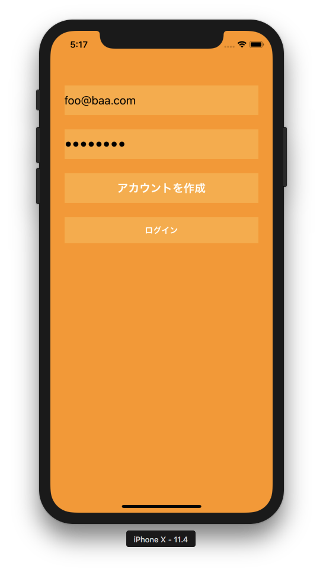
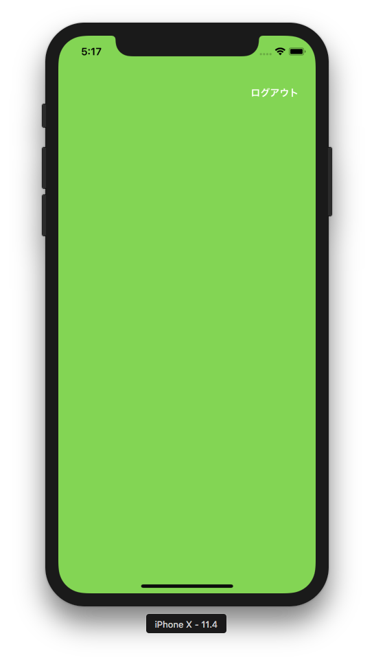

# FirebaseAuthApp

 

### Firebase Console で以下の作業をする

* Firebase で新しいアプリを作る
* iOS アプリを登録する
* 設定ファイル (GoogleService-Info.plist) をダウンロード→プロジェクトに追加
* Firebase SDK (CocoaPod) のインストール
* アプリを実行してインストールを確認
